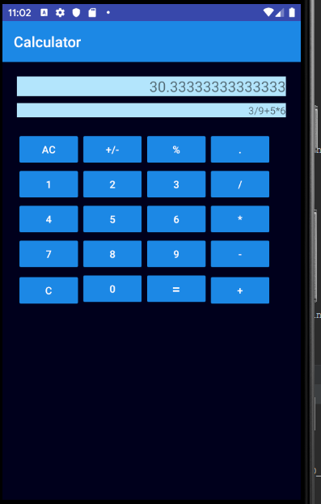
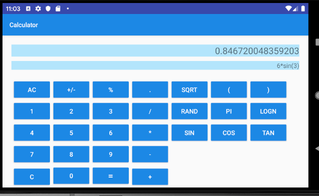

# Week1Day5
Coding
Create a calculator app to perform all the standard calculator operations like addition, subtraction, multiplication, divide etc. 
 -No edittexts
 -Changing the orientation to landscape(layout qualifier) will display now functionality (Scientific calculator)
 Hint: Create all buttons using Relative/Grid Layout and append the values to the TextView. Show the result in a separate TextView.

